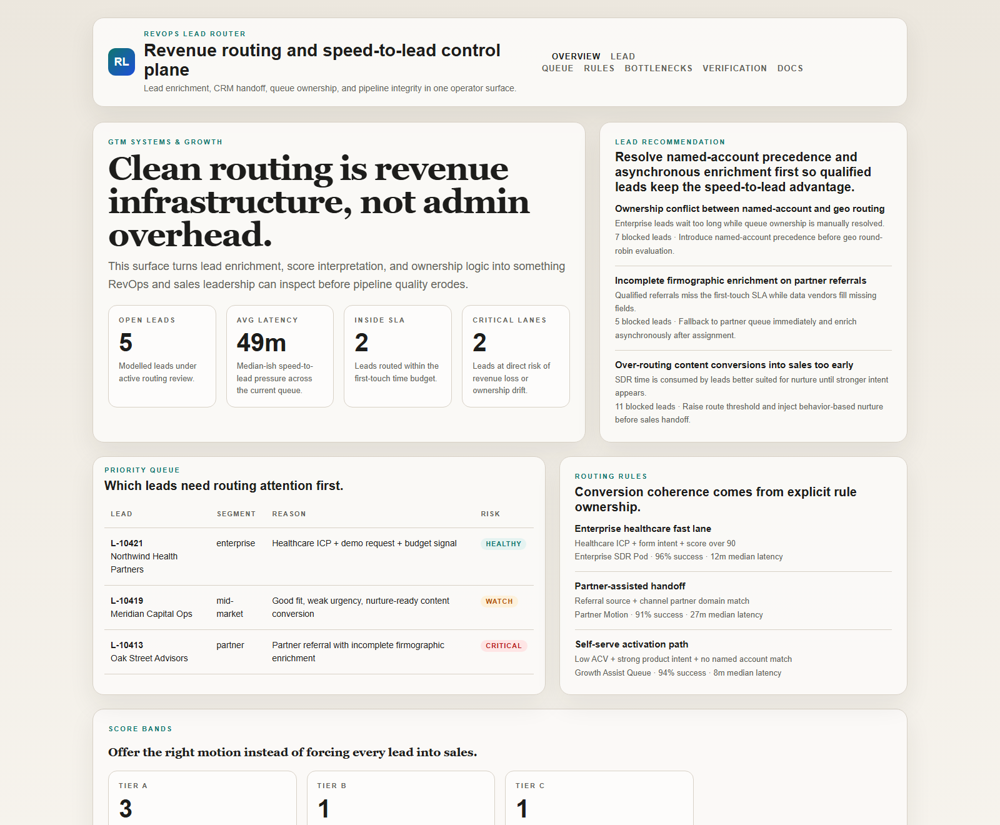
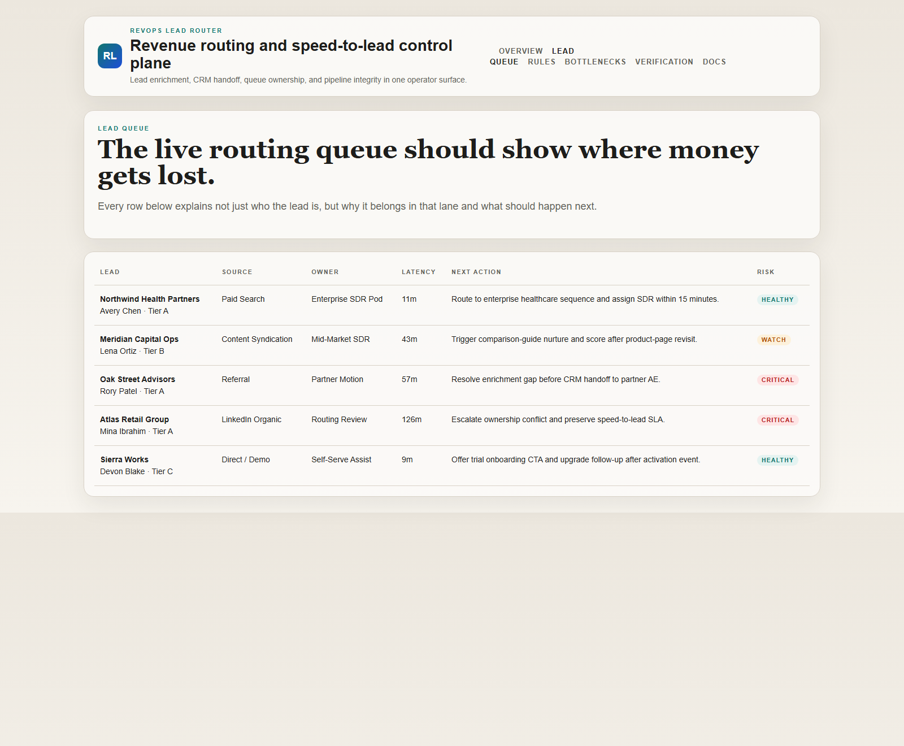
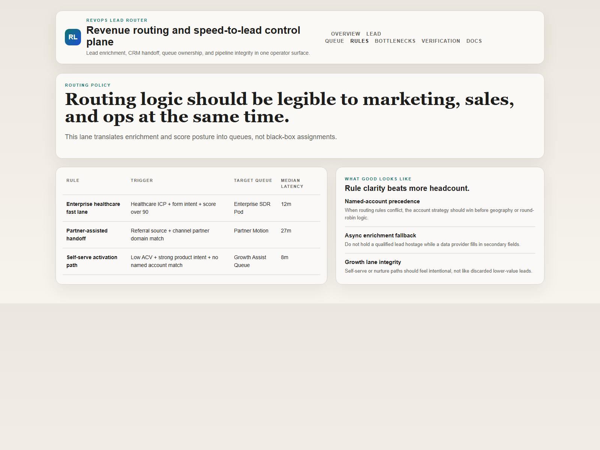
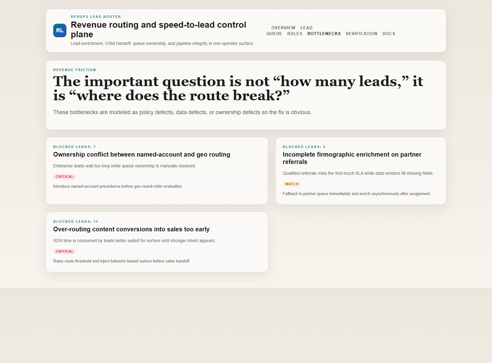

# RevOps Lead Router

TypeScript control plane for lead enrichment, queue assignment, speed-to-lead posture, and CRM routing integrity.

## Why this exists

Revenue systems break long before pipeline dashboards admit it. The damage usually starts in the middle:
- good leads stall during enrichment
- routing rules conflict across named accounts, geography, and segment ownership
- marketing handoff logic sends too many leads into sales too early
- high-fit opportunities wait in admin lanes instead of reaching the right rep fast

`revops-lead-router` models that operational layer so Growth, RevOps, and sales leadership can inspect where routing is protecting revenue and where it is quietly eroding it.

## Routes

- `/`
- `/queue`
- `/routing-rules`
- `/bottlenecks`
- `/verification`
- `/docs`

## API

- `/api/dashboard/summary`
- `/api/queue`
- `/api/routing-rules`
- `/api/bottlenecks`
- `/api/verification`
- `/api/sample`

## Screenshots






## Local Development

```powershell
cd revops-lead-router
npm install
npm run dev
```

Open:
- [http://127.0.0.1:5258/](http://127.0.0.1:5258/)
- [http://127.0.0.1:5258/queue](http://127.0.0.1:5258/queue)
- [http://127.0.0.1:5258/routing-rules](http://127.0.0.1:5258/routing-rules)
- [http://127.0.0.1:5258/bottlenecks](http://127.0.0.1:5258/bottlenecks)
- [http://127.0.0.1:5258/verification](http://127.0.0.1:5258/verification)

## Validation

- `npm run build`
- `npm run test`
- `npm run demo`
- `npm run smoke`
- `npm run render:assets`

## Docs

- [Architecture](./docs/architecture.md)
- [Origin](./docs/ORIGIN.md)
- [Changelog](./CHANGELOG.md)
